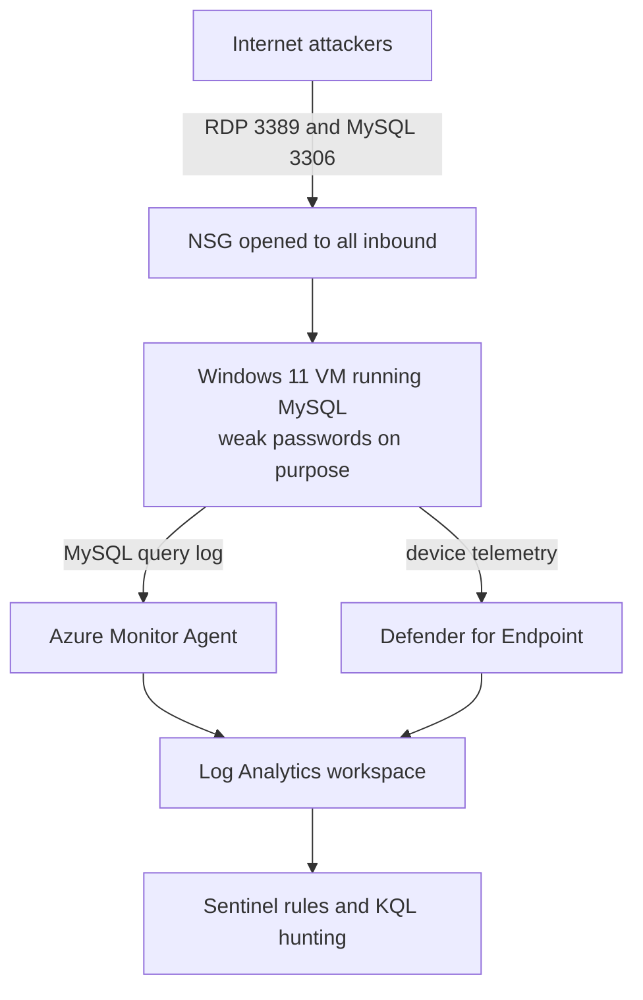

# Live Honeypot: MySQL Ransom Attack and RDP Brute Force

**I built a Windows VM running MySQL in Azure, deliberately made it vulnerable, exposed it to the internet, and investigated what real attackers did to it.**

Built as part of the Log(N) Pacific Cyber Range capstone, using Microsoft Defender for Endpoint, Azure Monitor, Log Analytics, Microsoft Sentinel and KQL. Hostnames, IPs and attacker infrastructure are redacted.

📄 [Original incident report (PDF)](Incident_Report_CORP-DB-01-1.pdf), written at the time. Some of its conclusions were wrong; see [Corrections](#what-the-first-analysis-got-wrong).

---

## TL;DR

* One Windows 11 VM running MySQL, exposed on **RDP (3389)** and **MySQL (3306)** with weak credentials on purpose.
* **About 10 hours** after exposure, attackers logged into MySQL as `root`, previewed the credential and payment tables, **dropped the databases and left a Bitcoin ransom note** in a table called `RECOVER_YOUR_DATA`.
* This wipe and ransom routine happened **four times in about 21 hours**, from different IPs in the same /24 range. It looks automated.
* At the same time, RDP and SMB were brute forced. The top source IP made **24,536 attempts**, and two IPs **successfully authenticated as Administrator**.
* No ransomware, malware or file encryption was found on the VM. This was a **database extortion attack**, not host ransomware.
* The first AI-assisted analysis got several things wrong, including treating the VM as two machines and flagging my own evidence collection as attacker activity. I verified and corrected these below.

---

## How I built it



The build followed a **"harden first, expose last"** order, so the logging and detections were in place before any attacker could arrive:

1. **Build locked down.** Deployed a Windows 11 VM with a legitimate looking name, blocked all inbound traffic, and onboarded it to Defender for Endpoint.
2. **Install MySQL and fake data.** Installed MySQL 8.0 and loaded dummy databases (customers, orders, payments and credentials tables) so there was something worth attacking.
3. **Wire up logging.** Turned on MySQL's general query log, which records every connection and query. A Data Collection Rule told the Azure Monitor Agent to ship that log file into a custom `MySQLAudit_CL` table in Log Analytics.
4. **Write detections while it was still clean.** Created Sentinel analytics rules for successful logons to the VM and successful logins to MySQL.
5. **Capture a baseline.** Collected a Defender investigation package before exposure, to compare against afterwards.
6. **Weaken and expose.** Enabled the Administrator account with a weak password, enabled Guest, created a `root` MySQL account that can log in over the network with trivial credentials, disabled Windows Firewall, and opened the NSG to all inbound traffic.

**Exposure time: 2026-07-09 03:45 UTC.**

---

## What happened

### The MySQL attack

The logs show a failed `root` login with no password, followed straight away by a successful one. No exploit was needed.

Once in, the attacker:
1. Listed the databases and tables
2. Ran `SELECT ... LIMIT 10` against the `credentials` and `payments` tables, previewing usernames, passwords and masked card data
3. Ran `DROP` on the tables in `corp_prod_db` and the sample `sakila` and `world` databases
4. Created a `RECOVER_YOUR_DATA` table containing a ransom note with a Bitcoin address and contact email

The same routine came back three more times from other IPs in the same /24 range, each time dropping and recreating the ransom table. Other IPs only brute forced or looked around; one made 914 connection attempts. The last session simply read the ransom note back.

Only preview style `SELECT` queries appear in the log, with no bulk dump. Whether data was actually copied out can't be confirmed from these logs. The note implies the data was taken, but these bots commonly drop the data without keeping a copy.

### The RDP and SMB brute force

Eleven IPs brute forced the VM, trying `administrator`, `root`, `admin` and dictionary names like `backup`, `support` and `office`. Two IPs **succeeded as Administrator**:

| Time (2026) | Source | Result |
|---|---|---|
| Jul 9, 16:00 | ATTACKER-IP-7 | Logon success, then more failed attempts |
| Jul 9, 21:50 | ATTACKER-IP-9 | Administrator and Guest, all failed |
| Jul 10, 00:56 | ATTACKER-IP-8 | Logon success |

Both successes were **LogonType `Network`**, meaning an authentication over SMB or similar, not an interactive RDP desktop session. After them, no processes, files or registry changes by the Administrator account were found. The most likely explanation is an automated tool confirming that the password works, not a person using the machine. This is still recorded as a visibility gap rather than proof of no impact, because full command line logging wasn't enabled.

### Timeline

| Time (2026, as logged) | Event | Source |
|---|---|---|
| Jul 9, 03:45 | VM and MySQL exposed to the internet | Lab notes |
| Jul 9, 14:12 | First successful MySQL `root` login | MySQLAudit_CL |
| Jul 9, 14:13 to 14:14 | Tables previewed and dropped, ransom note inserted | MySQLAudit_CL |
| Jul 9, 16:00 | First successful Administrator logon (network) | DeviceLogonEvents |
| Jul 9, 22:49 to 23:49 | Brute force and `root` success, recon only | MySQLAudit_CL |
| Jul 10, 00:56 | Second Administrator logon success | DeviceLogonEvents |
| Jul 10, 05:26 | Second wipe and ransom cycle | MySQLAudit_CL |
| Jul 10, 10:25 | Third wipe and ransom cycle | MySQLAudit_CL |
| Jul 10, 11:32 | Fourth wipe and ransom cycle | MySQLAudit_CL |
| Jul 10, 16:52 to 17:05 | Final session reads the ransom note back | MySQLAudit_CL |

Outbound traffic from the VM showed only denied NTP (port 123) flows. The lab tenant blocks most outbound traffic, so nothing like command and control or exfiltration succeeded over the network.

---

## What the first analysis got wrong

The original report was written with AI assistance from exported logs, and the host forensics section was generated by AI from the before and after investigation packages. On review, several conclusions didn't hold up:

| Original claim | What actually happened | How I know |
|---|---|---|
| Two machines: a MySQL server and a separate Windows host, with "likely unrelated" attacks | **One VM.** MySQL ran on the same Windows machine. The Defender tables use a shortened device name, while the MySQL log table takes the full Azure VM name from its resource ID, so the same VM appeared under two slightly different names | Only one VM was built. The network query on the "Windows host" shows `mysqld.exe` handling the attacker connections |
| "No link found between the two hosts" | The same query returned 13 connections from attacker IPs to `mysqld.exe` | The report's own screenshot |
| Discovery: attacker generated `Arp.txt` and `IpConfig.txt` | Those files are **part of the Defender investigation package** I collected | They only exist in the package output |
| Collection and exfiltration using `ROBOCOPY` | Most likely the investigation package collection copying files into its output folder | Only appears in the post-breach package, which is when the collection ran |
| Command and control to a `trafficmanager.net` domain | Azure Traffic Manager fronts Microsoft services; the VM was running Defender and the Azure Monitor Agent | Expected telemetry for an MDE-onboarded Azure VM |
| Suspicious changes to `mysqld.exe` PID and service states | The VM shut down automatically every night, and every reboot changes process IDs and service states | Lab auto-shutdown schedule |

**Open question:** several `root` logins from **localhost** on Jul 10, just before `DROP schema recover_your_data`, ran `SHOW FULL TABLES` and `SHOW FULL COLUMNS`. MySQL Workbench sends those automatically when browsing a schema, so this is consistent with my own cleanup during recovery. It couldn't be conclusively attributed because the logs had aged out by the time I checked.

**Lesson:** AI analysis is useful for a first pass over thousands of log rows, but it confidently reports normal system and tooling behaviour as attacker activity. Every finding needs checking against how the environment was actually built.

---

## MITRE ATT&CK mapping

| Tactic | Technique | ID |
|---|---|---|
| Initial Access | External Remote Services (RDP, MySQL exposed) | T1133 |
| Credential Access | Brute Force: Password Guessing | T1110.001 |
| Initial Access / Persistence | Valid Accounts: Default Accounts (`root`, Administrator) | T1078.001 |
| Collection | Data from Information Repositories (database) | T1213 |
| Impact | Data Destruction | T1485 |
| Impact | Financial Theft (extortion demand) | T1657 |

---

## Key queries

**Successful MySQL logins** (parses the raw log lines into columns; based on the parser provided in the lab)

```kql
let MyDevice = "<VM name>";
let Exposure = todatetime("2026-07-09T03:45:12Z");
let FailedConnections =
    MySQLAudit_CL
    | extend RawData = replace_string(RawData, "\t", " ")
    | extend DeviceName = tostring(split(_ResourceId, "/")[-1])
    | where DeviceName == MyDevice and RawData has "Access denied"
    | extend ConnectionId = extract(@"^\S+\s+(\d+)\s+Connect", 1, RawData)
    | distinct ConnectionId;
MySQLAudit_CL
| where TimeGenerated > Exposure
| extend RawData = replace_string(RawData, "\t", " ")
| extend DeviceName = tostring(split(_ResourceId, "/")[-1])
| where DeviceName == MyDevice and RawData has "Connect"
| extend ConnectionId = extract(@"^\S+\s+(\d+)\s+Connect", 1, RawData)
| extend ActionType = case(RawData has "Access denied", "LogonFailure",
                           ConnectionId in (FailedConnections), "Ignore", "LogonSuccess")
| where ActionType == "LogonSuccess"
| extend Username = replace_string(tostring(split(tostring(split(RawData, "@")[0]), " ")[-1]), "'", "")
| extend IpAddress = replace_string(tostring(split(split(RawData, "@")[1], " ")[0]), "'", "")
| project TimeGenerated, Username, IpAddress, RawData
| order by TimeGenerated asc
```

**What attackers ran in MySQL**

```kql
MySQLAudit_CL
| where TimeGenerated > todatetime("2026-07-09T03:45:12Z")
| extend DeviceName = tostring(split(_ResourceId, "/")[-1])
| where DeviceName == "<VM name>" and RawData has "Query"
| extend Query = tostring(split(replace_string(RawData, "\t", " "), "Query")[1])
| where Query has_any ("DROP", "SELECT", "INSERT", "CREATE")
| project TimeGenerated, Query
| order by TimeGenerated asc
```

**Logons to the VM**

```kql
DeviceLogonEvents
| where TimeGenerated > todatetime("2026-07-09T03:45:12Z")
| where DeviceName == "<VM name>"
| where AccountName in~ ("administrator", "guest")
| project TimeGenerated, RemoteIP, AccountName, ActionType, LogonType
| order by TimeGenerated asc
```

---

## Lessons learned

1. **Exposed services get found fast.** Around 10 hours from exposure to a destroyed database, with no human needed on the attacker's side.
2. **Never expose databases to the internet.** Database access belongs behind a VPN, bastion host or private network, with strong passwords on every account.
3. **Lock down RDP.** Account lockout, MFA, and no direct internet exposure would have stopped every Administrator logon here.
4. **Detect the damage, not just the login.** A rule alerting on `DROP DATABASE`, `DROP TABLE` or inserts into a `RECOVER_YOUR_DATA` style table would catch this attack as it happens.
5. **Turn on command line logging.** Process creation auditing (event 4688) with command lines would have closed the biggest gap in the host investigation.
6. **Check the AI's work.** See the corrections section above.

---

## Tools

**Azure VMs and NSGs · Microsoft Defender for Endpoint · Azure Monitor Agent and Data Collection Rules · Log Analytics · Microsoft Sentinel · KQL · MySQL 8.0 · Defender investigation packages**

*Author: David Koschmann*
